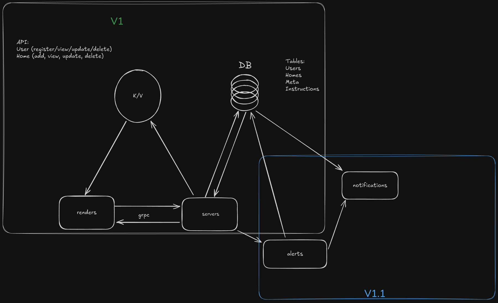

NYUMSPACE Architecture

## Local Development
Update Dependencies

docker build -f Dockerfile.base -t nyumspace-base:latest .

Build Binary

docker build -t nyumspace .

Update KIND cluster

kind load docker-image nyumspace:latest